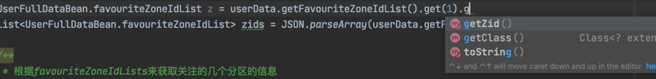
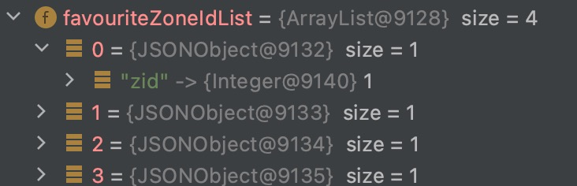
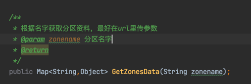
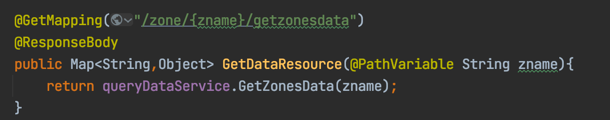
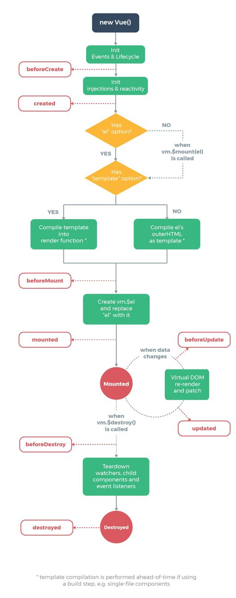
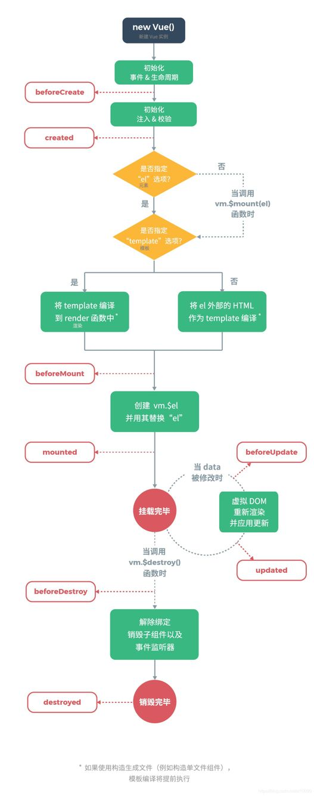

# 工程简介

# 延伸阅读

### 记录
> * 验证账号密码一定要最后验证账号密码是否正确，在使用Bean的情况下一定得先要验证账号是否为空，不然会报错空指针异常
> * 前端ajax传参数为json对象也就是object对象，后端目前只找到用String获取然后split()拼接，按照网上的教程来说可以创建一个java对象，用List存储或者是Map，或者是用JSON存，可惜我一个都没有成功过。最后老老实实传字符串
> * switch一定记得加break不然会往下继续执行
> * Mysql 5.7以后增加了json数据类型，可以用来存列表，我这里用来省略一些关联表，举个例子，用户关注的分区，以前应该需要一个pid-zid的关联表，现在我用json类型存的是[{"zid":1},{"zid":2}]这种json列表形式，用mybatis plus自带的fastjsonhandler处理，实体类中用一个包含两个变量的实体类存储例如zuLink，在user表里面收到的json在user实体类中定义为List<zu_Link>，注意需要在pom.xml引入fastjsonhandler这个类的依赖包
> * ###薛定谔的JSONObejct
>  遇到一个很奇怪的问题，跟Fastjsonhandeler这个类有关，这个类是用来处理json对象的，这里我用来从mysql数据库中获取一个json类型的数据，用一个新的实体类存这个json对象，由于我是数组型的json对象，因此我用的是List<favouriteZoneIdList'>这个list来存，然后问题来了，数据的确可以获取到，但是你要用前面那个实体类的getter去获取它的话，会报一个JSONObject cannot be cast to favouriteZoneIdList，那我就很疑惑了，明明是用这个实体类存的为什么又变成了JSONObject，那我debug看一下,终于发现了问题
>   
>  首先编译器的确是把它当做一个实体类的，你可以直接.调用他的getter方法                  
> 

>  但是他实际是几个JSONObject，但是你要是直接调用他的Object get方法直接会报错，就很奇怪，感觉他就是处于一个不确定的叠加态，你观测的时候他就是一个实体类，但是他一运行你看不到了他就变成两了JSONObject
>  那么最后我是怎么解决的的呢，先把它转换为String，然后用JSONOject的JSON.parseArray(String,favouriteZoneIdList)把它转成一个实体类对象，终于能正常使用他的成员方法了，头一次遇到这种bug，我称它为薛定谔的JSONObject类
> * ###前后端通过url里面的参数传参数的问题举个例子 
>  
> 比如上面这个函数，获取分区的资料，不可能所有的分区url都写映射，因此动态构造分区url，根据url里面的参数名字来查询才是正常操作 
>  
> Controller里面用@PathVariable 这个注解来获取url里面的一个参数,{zanme}就是一个参数，然后用一个String类型变量存好了，直接调用带参数的函数
> * ###前端的异步传输数据 
>  
>  
>  异步传输就是发送一个http请求之后会等待响应，一般后台有一个Responsebody返回一个数据，然后把返回的数据放在Vue容器里或者直接jquery操作DOM，我采用的是用axios做异步Vue渲染，但是发现渲染总是会发生在获得数据之前，不管vue的生命周期created还是mounted放都是一样，研究超过一整天的时间后发现了问题，一定需要设置一个手段，让页面停下来等待数据好，这也就是为什么大型网站一般会有个等待过程
> 我的做法是现在vue挂载的div中设置v-if=false,等数据传完了再给他设置true，可以实现功能，但是这个是最低级的，更高级的是用jquery的$nextTip，和forceUpdate，为什么我用最低级的呢，因为高级的用不成功，可能是前端的整合npm的环境而我是js文件导入的

